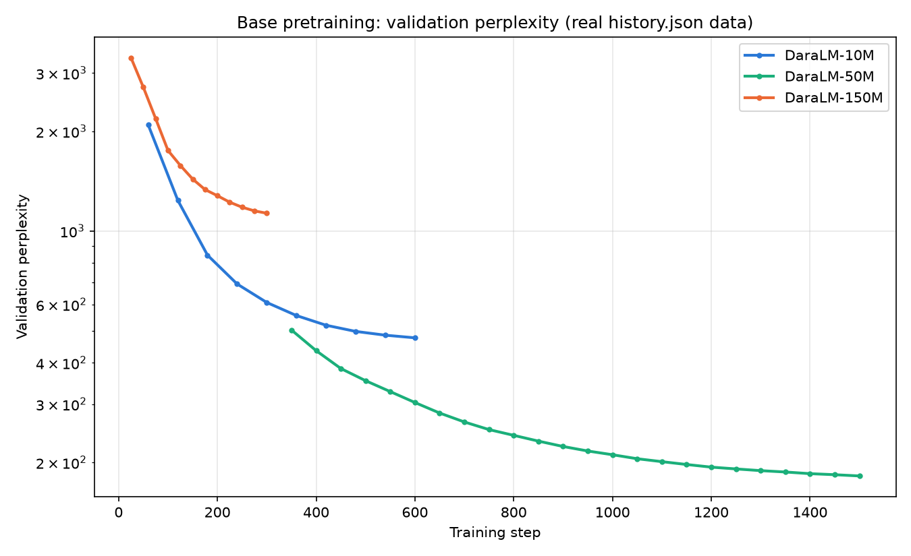
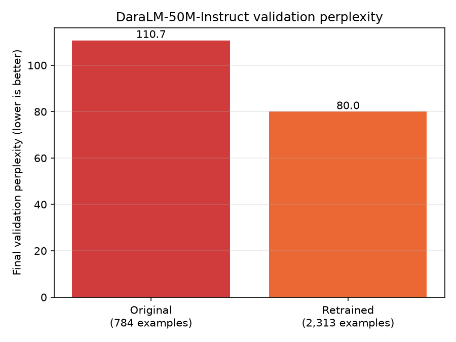
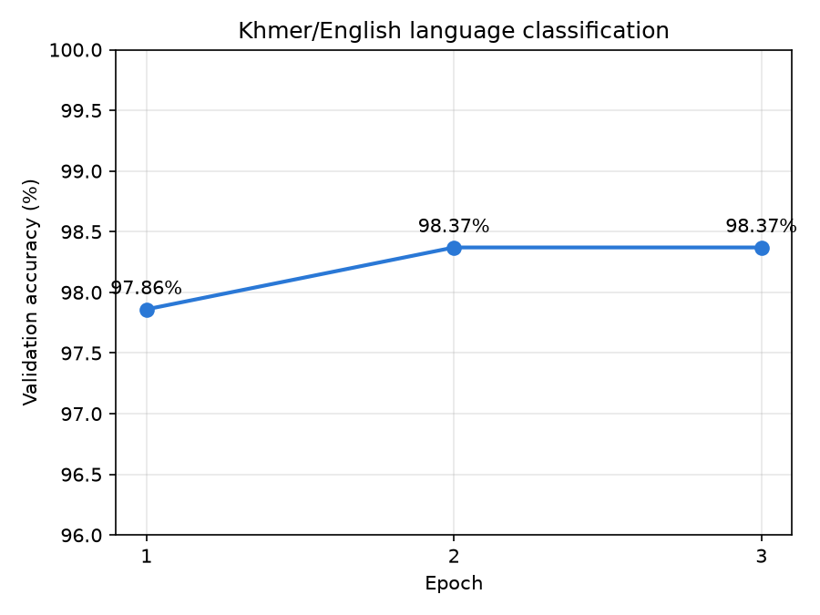
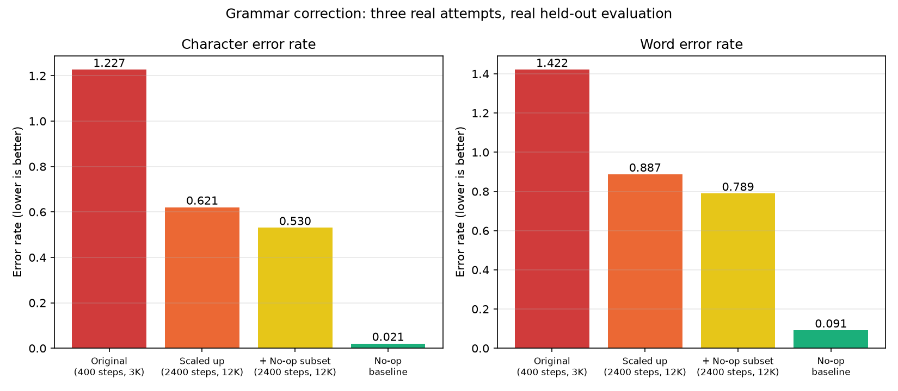
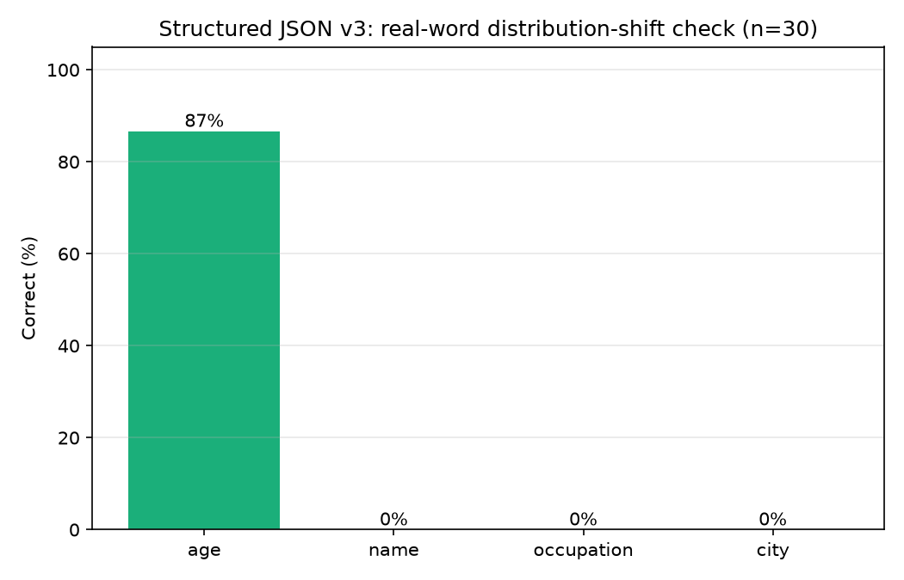

# DaraLM

DaraLM is a from-scratch decoder-only Transformer for Khmer and English. The
repository covers data collection, cleaning, tokenizer training, pretraining,
supervised fine-tuning, evaluation, and a FastAPI testing interface.

This is an educational research project, not a production language model.
Generated facts are unreliable, language can drift, and no safety tuning has
been performed.

## Current status

| Component | Status |
|---|---|
| Khmer/English data pipeline | Working |
| SentencePiece tokenizer | Working |
| Decoder-only Transformer | Working |
| Base and supervised training | Working |
| Evaluation tools | Working |
| FastAPI service and browser UI | Working |
| Production-quality generation | Not achieved |

The main trained checkpoints are:

| Model | Parameters | Training state | Validation perplexity |
|---|---:|---|---:|
| DaraLM-50M Base | 33.4M | 1,500 steps | 182.0 |
| DaraLM-50M Instruct | 33.4M | SFT from Base | 110.7 on its SFT validation set |
| DaraLM-150M Base | 149.2M | 300 steps | 1,131.5 |

The 150M model is substantially undertrained and currently performs worse than
the 50M model. Lower SFT perplexity has also not produced reliable factual or
instruction-following behavior.

Detailed results and limitations are in the model cards:

- [DaraLM-50M](MODEL_CARD.md)
- [DaraLM-50M-Instruct](MODEL_CARD_INSTRUCT.md)
- [DaraLM-150M](MODEL_CARD_150M.md)

## Results at a glance

### Base-model training



DaraLM-50M kept improving through step 1,500. DaraLM-150M also improved, but its
short 300-step run left it far behind the smaller model.

### Instruction tuning



More instruction data lowered validation perplexity from 110.7 to 80.0, but
manual generation checks did not show a corresponding gain in answer quality.

### Language classification



A frozen 50M backbone with a linear head reached 98.37% Khmer/English validation
accuracy. This validates the classification path, but the scripts are easy to
separate by Unicode and do not demonstrate broad semantic understanding.

### Grammar correction



Larger training runs reduced both error rates, but every model remained much
worse than returning the input unchanged. Grammar correction is still a failed
capability at this scale.

### Structured extraction under distribution shift



The model usually copied numeric ages but failed on unseen real names,
occupations, and cities. Valid JSON alone therefore overstates extraction
quality.

The remaining generated figures are available in [`charts/`](charts/).

## Architecture

```text
Token IDs
  -> Token Embedding
  -> [RMSNorm -> Causal Attention + RoPE -> residual
      RMSNorm -> GELU Feed-Forward       -> residual] x N
  -> Final RMSNorm
  -> Weight-tied LM Head
  -> Logits
```

The implementation includes causal masking, rotary position embeddings,
pre-normalization, weight tying, GPT-style initialization, KV-cached generation,
mixed-precision training, gradient accumulation, checkpoint resume, and
tokenizer fingerprint validation.

Model dimensions and training settings come from YAML files in `configs/`.

## Repository layout

```text
api/          FastAPI routes, schemas, observability, and model service
configs/      Model and training configurations
daralm/data/  Collection, cleaning, normalization, datasets, and task data
daralm/model/ Transformer implementation
daralm/tokenizer/
              SentencePiece training and evaluation
daralm/training/
              Optimizer, scheduler, checkpoints, and trainer
daralm/inference/
              Sampling and KV-cached generation
daralm/evaluation/
              Perplexity and task metrics
scripts/      Data, training, evaluation, and reporting commands
tests/        Unit and integration tests
web/          Self-contained browser testing UI
```

Generated data, checkpoints, and experiment outputs are intentionally ignored by
Git.

## Setup

Python 3.11 and [`uv`](https://docs.astral.sh/uv/) are recommended.

```bash
uv python install 3.11
uv sync
```

Useful commands:

```bash
make test
make lint
make serve
```

`requirements.txt` is generated from `pyproject.toml` and `uv.lock`; do not edit
it manually.

## Data pipeline

Build a bounded Khmer/English Wikipedia dataset:

```bash
uv run python scripts/prepare_dataset.py \
  --languages km en \
  --docs-per-language 8000
```

To rerun cleaning and splitting without downloading again:

```bash
uv run python scripts/prepare_dataset.py --skip-fetch
```

The pipeline normalizes Unicode, removes markup and low-quality documents,
deduplicates records, and creates deterministic train/validation/test splits.
Source and licensing metadata is recorded under `data/raw/`.

### Common Crawl

Fetch a bounded WET sample for general Khmer/English discovery:

```bash
uv run python scripts/fetch_commoncrawl.py \
  --languages km en \
  --docs-per-language 100
```

For higher-confidence Khmer pages, query the Common Crawl URL index and verify
the fetched records locally:

```bash
uv run python scripts/fetch_commoncrawl_khmer.py --docs 200
```

Preview and merge the verified Khmer records:

```bash
uv run python scripts/merge_commoncrawl_dataset.py --dry-run
uv run python scripts/merge_commoncrawl_dataset.py
```

The current local cleaned corpus contains 16,077 documents: 14,469 train, 802
validation, and 806 test. This includes 138 verified Khmer Common Crawl records.
Existing released checkpoints were trained before that merge; retraining is
required for them to learn the new data.

Data locations:

```text
data/raw/       Downloaded source records and manifests
data/cleaned/   Cleaned JSONL splits, statistics, and merge history
data/commoncrawl/
                Common Crawl intermediate artifacts when present
```

## Tokenizer

Train and compare BPE and Unigram SentencePiece tokenizers:

```bash
uv run python scripts/train_tokenizer.py --vocab-size 16000
```

The project uses the Unigram model with fixed special-token IDs:
`<pad>=0`, `<unk>=1`, `<bos>=2`, and `<eos>=3`.

Default tokenizer path:

```text
checkpoints/tokenizer/unigram.model
```

The API also recognizes the packaged release tokenizer at
`experiments/hf_release/daralm-50m/tokenizer.model`.

## Training

Inspect a configuration before training:

```bash
uv run python scripts/inspect_model_config.py --config configs/50m.yaml
```

Train or resume a base model:

```bash
uv run python scripts/train.py --config configs/50m.yaml
uv run python scripts/train.py --config configs/50m.yaml --resume
```

Supervised fine-tuning starts from a base checkpoint:

```bash
uv run python scripts/train_sft.py \
  --config configs/50m-instruct.yaml \
  --base-checkpoint checkpoints/daralm-50m/best \
  --block-size 832
```

Checkpoints contain model, optimizer, scheduler, RNG, tokenizer fingerprint, and
configuration state. They are written under `checkpoints/<model-name>/`.

## Generation and evaluation

Generate from a training checkpoint:

```bash
uv run python scripts/generate.py \
  --checkpoint checkpoints/daralm-50m/best \
  --prompt "Cambodia is" \
  --max-new-tokens 80 \
  --temperature 0.8 \
  --top-p 0.9
```

Run the consolidated base-model evaluation:

```bash
uv run python scripts/evaluate.py
```

Task-specific evaluation scripts cover grammar correction, structured JSON,
classification, memorization, and model-card generation. Use `--help` on any
script for its current arguments.

## API and browser UI

Start the service:

```bash
make serve
```

Then open [http://127.0.0.1:8000](http://127.0.0.1:8000). The UI exercises chat,
raw generation, tokenization, normalization, model information, health, and
metrics.

Main endpoints:

| Method | Path | Purpose |
|---|---|---|
| GET | `/` | Browser testing UI |
| GET | `/health` | Readiness and device |
| GET | `/metrics` | Prometheus metrics |
| GET | `/v1/model` | Loaded model metadata |
| POST | `/v1/generate` | Raw completion |
| POST | `/v1/chat` | Chat-templated generation |
| POST | `/v1/tokenize` | Token IDs and pieces |
| POST | `/v1/normalize` | Khmer text normalization |

The default server searches for a training checkpoint first, then the packaged
release:

```text
checkpoints/daralm-50m/best
experiments/hf_release/daralm-50m
```

Override the serving artifacts with environment variables:

```bash
DARALM_CONFIG=configs/50m-instruct.yaml \
DARALM_CHECKPOINT=checkpoints/daralm-50m-instruct/best \
DARALM_TOKENIZER=checkpoints/tokenizer/unigram.model \
uv run uvicorn api.main:app --reload
```

Interactive API documentation is available at
[http://127.0.0.1:8000/docs](http://127.0.0.1:8000/docs).

### Docker

```bash
make docker-build
make docker-run
make docker-logs
make docker-stop
```

`configs/`, `checkpoints/`, and `data/` are mounted at runtime rather than baked
into the image.

## Tests

```bash
uv run pytest
uv run ruff check .
uv run ruff format --check .
```

The current suite contains 349 passing tests.

## Roadmap

[ROADMAP_NLP_PLATFORM.md](ROADMAP_NLP_PLATFORM.md) describes the broader Khmer
NLP direction. Near-term priorities are better and more varied pretraining data,
longer training, distribution-aware evaluation, and narrow measurable tasks.

## License

Code is MIT licensed. Dataset and model-weight terms depend on their source data;
see the manifests under `data/raw/` and the relevant model card.
